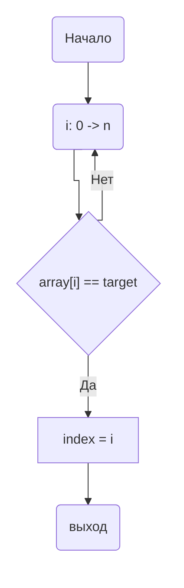

<h1>НИЯУ МИФИ. Лабораторная работа №2. Соколов Александр, Б20-505. 2022</h1>

<h2>Используемая система</h2>

<pre>CPU:
  Info: quad core model: AMD Ryzen 5 3500U with Radeon Vega Mobile Gfx
    bits: 64 type: MT MCP arch: Zen/Zen+ note: check rev: 1 cache: L1: 384 KiB
    L2: 2 MiB L3: 4 MiB
  Speed (MHz): avg: 1662 high: 2100 min/max: 1400/2100 boost: enabled
    cores: 1: 2100 2: 2100 3: 2100 4: 1400 5: 1400 6: 1400 7: 1400 8: 1400
    bogomips: 33549
</pre>
<h3>Среда разработки</h3>
<p>Язык программирования C</p>
<h3>Версия OpenMP</h3>
<ul>
    <li><b>gcc</b>:   201511</li>
    <li><b>clang</b>: 201811</li>
</ul>

<h3>Анализ алгоритма</h3>
<h4>Принцип работы</h4>
Приведенный алгоритм итерируется по массиву чисел и сравнивает их с заданным элементом <b>target</b>. Если элемент оказывается равен <b>target</b> то итерация завершается и выводится наименьший номер элемента в массиве через переменную <b>index</b>. Иначе, итерация продолжается. Если элемент не был найден индекс останется равным -1.

<h4>Блок-схема</h4>



<h3>Оценка временной сложности</h3>
<ul>
  <li><b>Лучший случай: </b>O(1)</li>
  <li><b>Худший случай: </b>O(n)</li>
  <li><b>Средний случай: </b>O(n)</li>
</ul>
<h4>Значение директив</h4>
<code>#pragma omp parallel for shared(array, count, chunk) default(none) private(i) schedule(dynamic, chunk) num_threads(threads)
</code><br>
Задается обасть параллельного цикла, с количеством тредов <b>threads</b>. Переменные <b>array</b>, <b>count</b> и <b>chunk</b> объявляются общими для всех тредов и непараллельной части алгоритма. Все новые переменные без явного указания класса не разрешены. Цикл выполняется <b>dynamic</b> образом с размером чанка <b>chunk</b> - это значит, что каждый раз когда определенный тред закончит выполнение своей части цикла, ему выдадется новые <b>chunk</b> итераций.<br>
Область - <code>цикл for генерации массива</code><br>
Эта директива необходима для того, чтобы массив генерировался быстрее.<br><br>
<code>#pragma omp parallel for shared(array, count, target) default(none) private(i) num_threads(threads) reduction(min: index)
</code><br>
Задается обасть параллельного цикла, с количеством тредов <b>threads</b>. Переменные <b>array</b>, <b>count</b> и <b>target</b> объявляются общими для всех тредов и непараллельной части алгоритма. Все новые переменные без явного указания класса не разрешены. Переменная <b>i</b> объявляется индивидуальной для каждого треда. <b>reduction</b> с опцией min - будет выбирать минимальный индекс из каждого, что нашел каждый тред по отдельности.<br>
Область - <code>цикл for</code><br>
Эта директива необходима для распараллеливания поиска первого индекса и соответственно уменьшения времени его поиска, иначе бы цикл последовательно выполнил <b>count</b> итераций.<br><br>

<h3>Экспериментальные вычисления</h3>
<ul>
    <li>
        Последовательный алгоритм
        <ul>
            <li>Average time spent: 0.0129926 sec</li>
        </ul>
    </li>
</ul>
<h3>Ускорение и эффективность</h3>


<h3>Заключение</h3>
В данной работе я написал свой первый параллельный цикл с использованием библитеки OpenMP на языке C. По графикам видно, что после 8 тредов прекращается рост ускорения и среднее время выполнения не уменьшается.
<h3>Приложение</h3>
<h4>Оценка работы последовательной программы</h4>

```c

#include <stdio.h>
#include <stdlib.h>
#include <omp.h>

void new_array(int* array, unsigned int* random_seed, int count){
    srand(*random_seed);
    int i;
    int chunk = count / 16;
    int threads = 16;
    #pragma omp parallel for shared(array, count, chunk) default(none) private(i) schedule(dynamic, chunk) num_threads(threads)
    for(i=0; i<count; i++){ 
       array[i] = rand(); 
    }
    *random_seed += rand();
}

int main(int argc, char** argv)
{
    const int count = 10000000;   
    unsigned int random_seed = 920214;
    const int num_exp = 20;


    int* array = 0;              
    int  index = -1;            

    srand(random_seed);

    array = (int*)malloc(count*sizeof(int));

    int target; 
    double t1, t2, res = 0.0;

    for(int i = 0; i < num_exp; i++){
        printf("started array\n");
        new_array(array, &random_seed, count);
        printf("ended array\n");
        target = array[rand() % count];
        t1 = omp_get_wtime();
        index = -1;
        for(int i=0; i<count; i++)
        {
            if(array[i] == target)
            {
                index = i;
                break;
            }
        }
        t2 = omp_get_wtime();
        res += t2 - t1;
    }
    res /= (double)(num_exp);
    printf("Average time: %g\n", res);

    free(array);
    return(0);
}

```

<h4>Оценка работы параллельной программы</h4>

```c

#include <stdio.h>
#include <stdlib.h>
#include <omp.h>
#include <time.h>

void new_array(int* array, unsigned int* random_seed, int count){
    srand(*random_seed);
    int i;
    int threads = 16;
    int chunk = count / threads;
    #pragma omp parallel for shared(array, count, chunk) default(none) private(i) schedule(dynamic, chunk) num_threads(threads)
    for(i=0; i<count; i++) { 
       array[i] = rand(); 
    }
    *random_seed += rand();
}

int main(int argc, char** argv)
{
    const int count = 10000000;
    unsigned int random_seed = 920214;
    const int num_exp = 20;
    const int thread_bound = 100;
    
    int** arrays = NULL;
    int* array = NULL;
    int  index, i, target, threads;

    double t1, t2, res;

    arrays = (int**)calloc(num_exp, sizeof(int*));
    for(int t = 0; t < num_exp; t++){
        array = (int*)calloc(count, sizeof(int));
        new_array(array, &random_seed, count);
        arrays[t] = array;
    }

    for(threads=1; threads <= thread_bound; threads++){
        fprintf(stderr, "curthreads: %d\n", threads);
        res = 0.0;
        for(int j = 0; j < num_exp; j++){
            target = arrays[j][rand() % count];
            index = count + 1; 
            
            t1 = omp_get_wtime();
            #pragma omp parallel for shared(arrays, count, target, j) default(none) private(i) num_threads(threads) reduction(min: index)
            for(i=0; i<count; i++){

                if(arrays[j][i] == target){
                    index = i;
                }
            }
            t2 = omp_get_wtime();
            res += t2 - t1;
        }
        res /= (double)(num_exp);
        fprintf(stdout, "(%d, %g), ", threads, res);
    }

    for(int t = 0; t < num_exp; t++){
        free(arrays[t]);
    }
    free(arrays);
    return(0);
}

```
