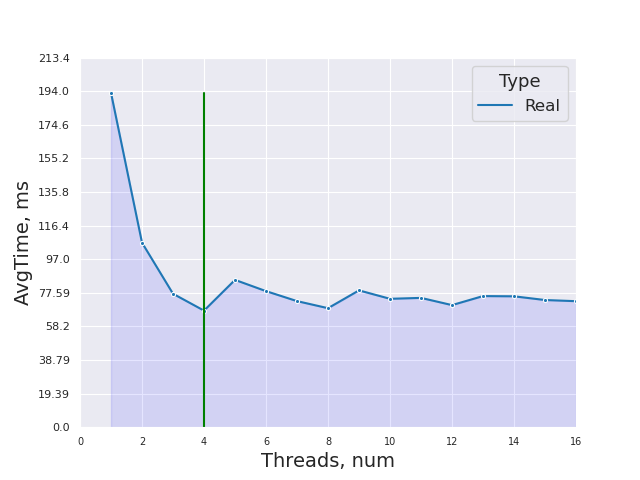
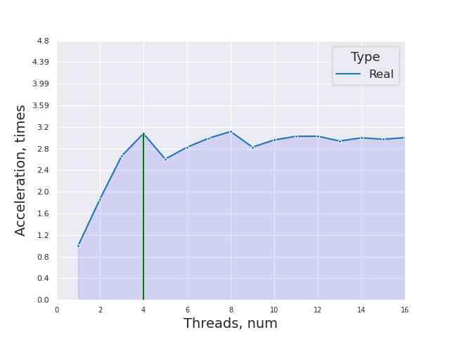
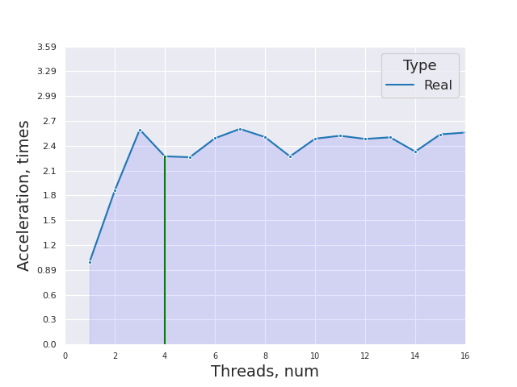
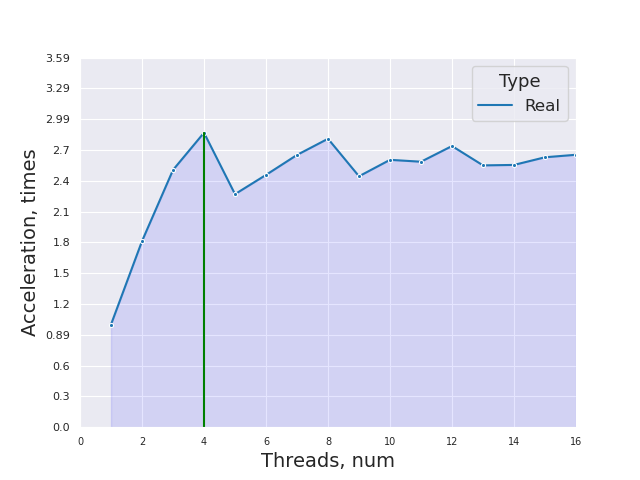
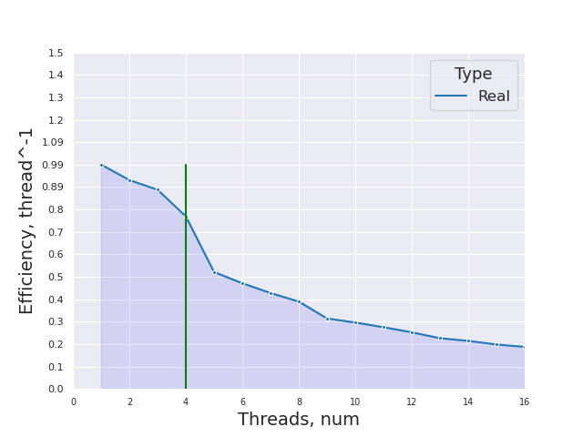

# НИЯУ МИФИ. Лабораторная работа №3. Соколов Александр, Б20-505. 2022.
## Среда разработки
<pre>System:
  Kernel: 6.0.6-arch1-1 arch: x86_64 bits: 64 compiler: gcc v: 12.2.0
    Desktop: MATE v: 1.26.0 Distro: Arch Linux
Memory:
  RAM: total: 14.58 GiB used: 8.73 GiB (59.9%)
  Array-1: capacity: 16 GiB slots: 2 EC: None max-module-size: 8 GiB
    note: est.
  Device-1: DIMM 0 type: DDR4 size: 8 GiB speed: 2400 MT/s
  Device-2: DIMM 0 type: DDR4 size: 8 GiB speed: 2400 MT/s
CPU:
  Info: quad core model: AMD Ryzen 5 3500U with Radeon Vega Mobile Gfx
    bits: 64 type: MT MCP arch: Zen/Zen+ note: check rev: 1 cache: L1: 384 KiB
    L2: 2 MiB L3: 4 MiB
  Speed (MHz): avg: 1487 high: 2100 min/max: 1400/2100 boost: enabled
    cores: 1: 1400 2: 2100 3: 1400 4: 1400 5: 1400 6: 1400 7: 1400 8: 1400
    bogomips: 33550
  Flags: avx avx2 ht lm nx pae sse sse2 sse3 sse4_1 sse4_2 sse4a ssse3 svm
OpenMP:
	gcc: 201511
</pre>

## Временная оценка алгоритма
- Лучший случай O(n*log(n)) - если массив уже отсортирован
- Худший случай O(n**2) - когда последний вложенный цикл выполняется полностью(что никогда не происходит)

## Анализ алгоритма
#### Принцип работы

#### Блок-схема


## Значение директив
<code>
#pragma omp parallel for shared(gap, count, array) private(i, j, tmp, part) default(none) num_threads(threads)
</code>

Задается обасть параллельного цикла, с количеством тредов <code>threads</code>. Переменные <code>array</code>, <code>count</code> и <code>gap</code> объявляются общими для всех тредов и непараллельной части алгоритма. Все новые переменные без явного указания класса не разрешены. Переменные <code>i</code>, <code>j</code>, <code>tmp</code> и <code>part</code> объявляется индивидуальной для каждого треда.
Область - <code>цикл for</code>

Эта директива необходима для распараллеливания сортировки элементов массива, которые отстоят друг от друга на расстоянии <code>gap</code>, потому что они не пересекаются с остальными и соответственно уменьшения время всей сортировки.


## Экспериментальные вычисления на 1000000 элементах
<ul>
	<li>Последовательный алгоритм: 0.755844 sec</li>
</ul>

## Параллельный алгоритм
1. Случайный массив со всеми различными элементами
2. Случайный массив со 100000(в среднем) одинаковыми элементами
3. Случайный отсортированный массив
4. Случайный массив отсортированный по убыванию

### Среднее время




### Среднее ускорение






### Средняя эффективность




## Заключение
В данной работе я разработал и реализовал свой параллельный алгитм сортировки Шелла. Ускорение возможно, потому что во втором вложенном цикле происходят сортировки пузырьком для элементов отстающих друг от друга на фиксированную величину <code>gap</code>, а следовательно все элементы, стоящие на индексах <code>0..gap-1</code>, образуют непересекающиеся множества. Анализ графиков показал, что:
- Как и ожидалось, после 8 тредов ускорения не происходит.
- Время, потраченное на сортировку массива, который уже отсортирован, но в обратном порядке, примерно в 2 раза больше, чем время, потраченное на сортировку уже отсортированного массива.
- Время, потраченное на сортировку массива с повторениями, примерно такое же как и время, потраченное на сортировку массива со всеми различными элементами.
- Как и ожидалось, на сортировку уже отсортированного массива тратится меньше всего времени.


## Приложение
### Оценка работы последовательной программы

```c
#include <stdio.h>
#include <stdlib.h>
#include <omp.h>

void new_array(int*, unsigned int*, int);

void new_array(int* array, unsigned int* random_seed, int count){
    srand(*random_seed);
    int i;
    for(i=0; i < count; i++) { 
       array[i] = rand(); 
    }
    *random_seed += rand();
}

double shellsort(int* array, int count){
    double t1, t2;
    t1 = omp_get_wtime();
    for(int gap = count/2; gap > 0; gap /= 2){
        for(int i = gap; i < count; i++){
            for(int j=i; j>=gap  && array[j-gap] > array[j]; j-=gap){
                int tmp = array[j];
                array[j] = array[j-gap];
                array[j-gap] = tmp;
            }
        }
    }
    t2 = omp_get_wtime();
    return t2 - t1;
}
 

int main(){
    int count = 100000;
    unsigned int random_seed = 1337;
    const int num_exp = 10;
    
    int**arrays = NULL;
    int* array = NULL;

    arrays = (int**)calloc(num_exp, sizeof(int*));
    for(int t = 0; t < num_exp; t++){
        arrays[t] = (int*)calloc(count, sizeof(int));
        new_array(arrays[t], &random_seed, count);
    }

    double t1, t2, res = 0.0;
    for(int e = 0; e < num_exp; e++){ 
        fprintf(stderr, "Number of experiment: %d/%d\n", e+1, num_exp);
        array = arrays[e];
        res += shellsort(array, count);
    }
//    printf("Num of iterations: %d, count: %d\n", r, count);
    res /= (double)(num_exp);
    fprintf(stdout, "%g", res); 

    for(int t = 0; t < num_exp; t++){
        free(arrays[t]);
    }
    free(arrays);
    return 0;
}

```
### Оценка работы параллельной программы

```c
#include <stdio.h>
#include <stdlib.h>
#include <omp.h>

void new_array(int*, unsigned int*, int);
double shellsort(int*, int, int);

void new_array(int* array, unsigned int* random_seed, int count){
    srand(*random_seed);
    int i;
    int r = rand() + count;
    for(i=0; i < count; i++) { 
      array[i] = rand();                   // all values are distinct
      //array[i] = r + i;                  // ascending
      //array[i] = r - i;                  // descending
      //array[i] = rand() % (count // 10)  // repetitions
    }
    *random_seed += rand();
}

double shellsort(int* array, int count, int threads){
    double t1, t2;
    int i, j, tmp, part;
    t1 = omp_get_wtime();
    for(int gap = count/2; gap > 0; gap /= 2){
#pragma omp parallel for shared(gap, count, array) private(i, j, tmp, part) default(none) num_threads(threads)
        for(i = 0; i < gap; i++){
            for(part = i + gap; part < count; part += gap){
                for(j=part; j>i  && array[j-gap] > array[j]; j-=gap){
                    tmp = array[j];
                    array[j] = array[j-gap];
                    array[j-gap] = tmp;
                }
            }
        }
    }
    t2 = omp_get_wtime();
    return t2 - t1;
}   

int main(){
    const int count = 1000000;
    unsigned int random_seed = 1337;
    const int num_exp = 10;
    const int thread_bound = 16;
    int threads;
    
    int*** arrays = NULL;
    int* array = NULL;

    arrays = (int***)calloc(thread_bound, sizeof(int**));
    for(int t = 0; t < thread_bound; t++){ 
        arrays[t] = (int**)calloc(num_exp, sizeof(int*));
        for(int e = 0; e < num_exp; e++){
            arrays[t][e] = (int*)calloc(count, sizeof(int));
            new_array(arrays[t][e], &random_seed, count);
        }
        random_seed = 1337;
    }

    double res = 0.0;

    for(threads = 1; threads <= thread_bound; threads++){
        fprintf(stderr, "Number of threads: %d/%d\n", threads, thread_bound);
        res = 0.0;
        for(int e = 0; e < num_exp; e++){ 
            fprintf(stderr, "Number of experiment: %d/%d\n", e+1, num_exp);
            array = arrays[threads-1][e];
            res += shellsort(array, count, threads);
        }
        res /= (double)(num_exp);
        fprintf(stdout, "(%d, %g), ", threads, res);
    }
    
    for(int t = 0; t < thread_bound; t++){ 
        for(int e = 0; e < num_exp; e++){
            free(arrays[t][e]);
        }
        free(arrays[t]);
    }
    free(arrays);
    return 0;
}

```
