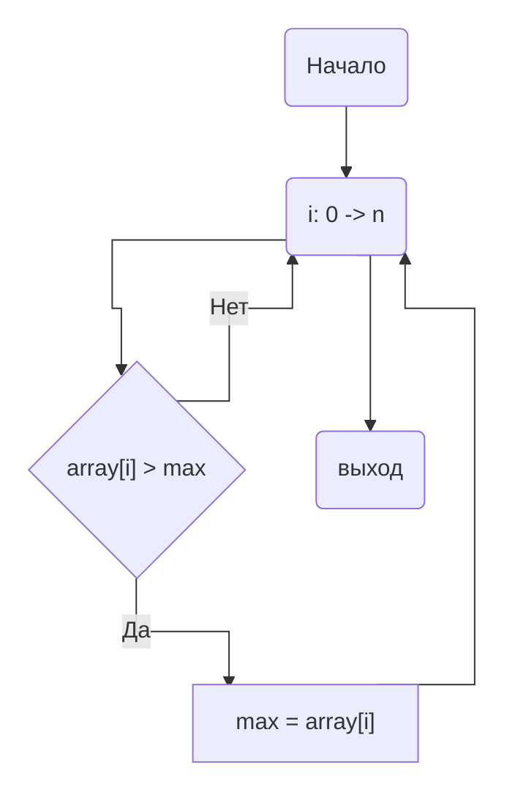

# НИЯУ МИФИ. Лабораторная работа №5. Соколов Александр, Б20-505. 2022.
## Среда разработки
<pre>System:
  Kernel: 6.0.2-arch1-1 arch: x86_64 bits: 64 compiler: gcc v: 12.2.0
    Desktop: GNOME v: 42.5 Distro: Arch Linux
Memory:
  RAM: total: 15.57 GiB used: 3.42 GiB (22.0%)
  Array-1: capacity: 32 GiB slots: 4 EC: None max-module-size: 8 GiB
    note: est.
  Device-1: DIMM_A1 type: no module installed
  Device-2: DIMM_A2 type: DDR3 size: 8 GiB speed: 1600 MT/s
  Device-3: DIMM_B1 type: no module installed
  Device-4: DIMM_B2 type: DDR3 size: 8 GiB speed: 1600 MT/s
CPU:
  Info: quad core model: Intel Core i5-4690 bits: 64 type: MCP arch: Haswell
    rev: 3 cache: L1: 256 KiB L2: 1024 KiB L3: 6 MiB
  Speed (MHz): avg: 3532 high: 3657 min/max: 800/3900 cores: 1: 3492 2: 3491
    3: 3491 4: 3657 bogomips: 27945
  Flags: avx avx2 ht lm nx pae sse sse2 sse3 sse4_1 sse4_2 ssse3 vmx

mpirun (Open MPI) 4.1.4
</pre>

## Временная оценка алгоритма
$O(n/p)$<br>

n - число элементов в массиве<br>
p - число используемых потоков<br>
## Анализ алгоритма
#### Принцип работы

#### Блок-схема




## Экспериментальные вычисления


## Заключение
В этой работе я впервые работал с MPI. В ходе работы была настроена рабочая среда. Были проанализированы время работы, ускорение и эффективность работы программы, а так же сравнены с такмими же характеристиками у программы с использованием OpenMP. 
В результате анализа я сделал вывод, что технология MPI тратит больше времени на пересылку данных между процессами, а следовательно и время работы перестает быть достаточно эффективными. Замечу что программа на которой это проверялось является слишком примитивной и делать какие либо выводы об MPI в целом лучше не буду. В данном же примере победа за OpenMP.

## Приложение
### Оценка работы параллельной программы

```c#include <stdlib.h>
#include <stdio.h>
#include <mpi.h>

int main(int argc, char** argv)
{
	int ret  = -1;	///< For return values
	int size = -1;	///< Total number of processors
	int rank = -1;	///< This processor's number

	const int count = 10000000; ///< Number of array elements
	const int random_seed = 920215; ///< RNG seed

	int* array = 0; ///< The array we need to find the max in
	int lmax = -1;	///< Local maximums
	int  max = -1;  ///< The maximal element
    double start, end;

	/* Initialize the MPI */
	ret = MPI_Init(&argc, &argv);

	/* Determine our rank and processor count */
	MPI_Comm_size(MPI_COMM_WORLD, &size);
	//printf("MPI Comm Size: %d;\n", size);
	MPI_Comm_rank(MPI_COMM_WORLD, &rank);
	//printf("MPI Comm Rank: %d;\n", rank);

	/* Allocate the array */
	array = (int*)malloc(count * sizeof(int));

	if (!rank) {
		srand(random_seed);
		for (int i = 0; i < count; i++) { array[i] = rand(); }
	}
    
    start = MPI_Wtime();
	/* Send the array to all other processors */
	MPI_Bcast(array, count, MPI_INTEGER, 0, MPI_COMM_WORLD);

	//printf("Processor #%d has array: %d", rank, count);
	//for (int i = 0; i < count; i++) { printf("%d ", array[i]); }
	//printf("\n");

	const int wstart = (rank    ) * count / size;
	const int wend   = (rank + 1) * count / size;

	//printf("Processor #%d checks items %d .. %d;\n", rank, wstart, wend - 1);

	for (int i = wstart; i < wend; i++){
		if (array[i] > lmax){ 
            lmax = array[i]; 
        }
	}

	//printf("Processor #%d reports local max = %d;\n", rank, lmax);
	MPI_Reduce(&lmax, &max, 1, MPI_INTEGER, MPI_MAX, 0, MPI_COMM_WORLD);
    end = MPI_Wtime();
	ret = MPI_Finalize();


	//if (!rank) { 
	//	printf("\n*** Global Maximum is %d;\n", max);
	//}
	//printf("MPI Finalize returned (%d);\n", ret);
    
    if (!rank){
        fprintf(stdout, "(%d, %g),", size, end-start);
    }
	return(0);
}

```

check.sh
```sh
#!/bin/bash

for i in $(seq 1 16);
do
    for _ in $(seq 1 20);
    do
        mpirun --hostfile hostfile -np "$i" parallel.out
    done
done
```
