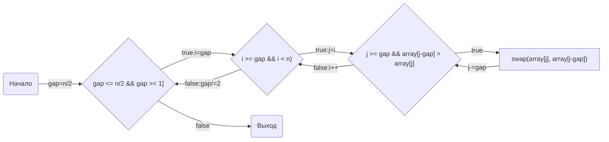

# НИЯУ МИФИ. Лабораторная работа №6. Соколов Александр, Б20-505. 2022.
## Среда разработки
<pre>System:
  Kernel: 6.0.2-arch1-1 arch: x86_64 bits: 64 compiler: gcc v: 12.2.0
    Desktop: GNOME v: 42.5 Distro: Arch Linux
Memory:
  RAM: total: 15.57 GiB used: 3.42 GiB (22.0%)
  Array-1: capacity: 32 GiB slots: 4 EC: None max-module-size: 8 GiB
    note: est.
  Device-1: DIMM_A1 type: no module installed
  Device-2: DIMM_A2 type: DDR3 size: 8 GiB speed: 1600 MT/s
  Device-3: DIMM_B1 type: no module installed
  Device-4: DIMM_B2 type: DDR3 size: 8 GiB speed: 1600 MT/s
CPU:
  Info: quad core model: Intel Core i5-4690 bits: 64 type: MCP arch: Haswell
    rev: 3 cache: L1: 256 KiB L2: 1024 KiB L3: 6 MiB
  Speed (MHz): avg: 3532 high: 3657 min/max: 800/3900 cores: 1: 3492 2: 3491
    3: 3491 4: 3657 bogomips: 27945
  Flags: avx avx2 ht lm nx pae sse sse2 sse3 sse4_1 sse4_2 ssse3 vmx

mpirun (Open MPI) 4.1.4
</pre>

## Анализ алгоритма
#### Блок-схема



## Экспериментальные вычисления


## Заключение
В этой работе я вот уже во второй раз работал с MPI. В ходе работы были проанализированы время работы, ускорение и эффективность работы программы, а так же сравнены с такмими же характеристиками у программы с использованием OpenMP. Алгоритм довольно примитивный: делим массив на столько же частей сколько потоков, причем мастеру оставляем маленький(обычно меньше чем у остальных, если не делится нацело) кусок в конце. Далее отсылаем по части каждому рангу, где тот сортирует нормальным образом эту часть и возвращает. Далее все отсортированные куски опять собирают вместе и еще один раз запускают сортировку Шелла уже на всем массиве. Эффективность данного метода весьма сомнительна, ведь после того как все процессы отсортировали свои части можно было слиянием получить отсортированный массив всего-то за О(n). Однако, то что части уже отсортированы должно помогать в сортировке Шелла, потому что там тоже всё разбивается на части. На более детальный анализ с матаном у меня не хватило времени. 
В результате анализа я сделал вывод, что технология MPI в этот раз показала себя ощутимо лучше. Возможно,это потому что теперь мы пересылаем не весь массив а только его часть. После 4 потоков время все таки опять начинает расти. Возможно это все еще влияет пересылка данных.

## Приложение
### Оценка работы параллельной программы

```c#include <stdio.h>
#include <stdlib.h>
#include <mpi.h>
#include <time.h>

void new_array(int*, unsigned int*, int);
void shellsort(int*, int);

void new_array(int* array, unsigned int* random_seed, int count){
    srand(time(NULL));
    int i;
    for(i=0; i < count; i++) { 
      array[i] = rand(); 
    }
    *random_seed += rand();
}

void shellsort(int* array, int count){
    for(int gap = count/2; gap > 0; gap/=2){
        for(int i = gap; i < count; i++){
            for(int j=i; j>=gap  && array[j-gap] > array[j]; j-=gap){
                int tmp = array[j];
                array[j] = array[j-gap];
                array[j-gap] = tmp;
            }
        }
    }
}

int main(int argc, char** argv){
    const int count = 1000000;
    unsigned int random_seed = 1337;
    double t1, t2;

    int ret = MPI_Init(&argc, &argv);
    int size, rank;
    int* array = (int*)calloc(count, sizeof(int));

    MPI_Status status;
    MPI_Comm_size(MPI_COMM_WORLD, &size);
    MPI_Comm_rank(MPI_COMM_WORLD, &rank);
    
    if(rank == 0){
        new_array(array, &random_seed, count);
    }

    int n = count / size;

    if(rank == 0){
        t1 = MPI_Wtime();
        for(int i = 1; i < size; i++){ // send each part, except for last one
            MPI_Send(array + n * (i - 1), n, MPI_INT, i, 0, MPI_COMM_WORLD);
        }

        int k = count - n * (size - 1); // main one
        shellsort(array + n * (size - 1), k);

        for(int i = 0; i < size - 1; i++){
            MPI_Recv(array + n * i, n, MPI_INT, MPI_ANY_SOURCE, 1, MPI_COMM_WORLD, &status);
        }

        shellsort(array, count); // final one
        t2 = MPI_Wtime();
        
        fprintf(stdout, "(%d, %g), ", size, t2 - t1);
        free(array);
    }
    else{
        int* cur = (int*)calloc(n, sizeof(int));
        MPI_Recv(cur, n, MPI_INT, 0, 0, MPI_COMM_WORLD, &status);
        shellsort(cur, n);
        MPI_Send(cur, n, MPI_INT, 0, 1, MPI_COMM_WORLD);
    }
    MPI_Finalize();
    return 0;
}

```

check.sh
```sh
#!/bin/bash

for i in $(seq 1 16);
do
    for _ in $(seq 1 20);
    do
        mpirun --hostfile hostfile -np "$i" parallel.out
    done
done
```